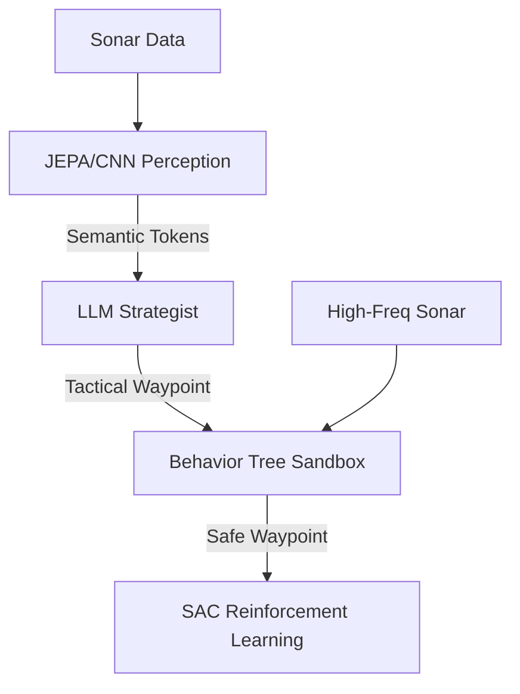

# System Architecture

This project is built around two primary architectural philosophies, separated by their operational readiness.

## 1. The Core System: Reactive C2 (Production Ready)

Located in `/core_system/`, this is a deterministic, math-driven architecture designed for absolute robustness. It doesn't rely on hallucinating AI; it relies on physics and vectors.

```mermaid
graph TD
    HQ[HQ Command Listener] --> |Target [X, Y, Z]| APF[APF Obstacle Bypasser]
    Sensor[Generic Sensor Mapper] --> |Obstacle List| APF
    IMU[IMU Turbulence Monitor] --> |Heave Variance| Weather[Weather Depth Controller]
    
    APF --> |XY Steer Vector| Thrusters((Thruster Output))
    Weather --> |Z Depth Command| Thrusters
```

### Artificial Potential Fields (APF)
Instead of plotting an explicit path around an object, the sub uses APF. 
- The HQ Target is assigned an *Attractive Force* (+).
- The obstacles are assigned a *Repulsive Force* (-).
The sub simply follows the path of least resistance, causing it to naturally "flow" around barriers like water around a stone.

### Storm Dive Protocol
Because water is a powerful shock absorber, violent surface weather does not affect the deep ocean. The `weather_depth_controller.py` monitors the IMU. If high heave variance is detected (surface turbulence), it overrides HQ's `Z` coordinate and forces a dive to a safe -30m depth.

---

## 2. Neuro-Symbolic Hybrid Architecture (Experimental)

Located in `/cognition/`, this architecture explores using Large Language Models (LLMs) for high-level tactical reasoning, made safe by wrapping them in deterministic **Behavior Trees**.



### The Sandbox Concept
LLMs are brilliant strategists but slow and prone to hallucination. By placing the LLM inside a fast (100Hz) Behavior Tree, we guarantee safety. If the LLM commands a move that would crash the sub, the Behavior Tree intercepts the command using high-frequency sensor data and fires an emergency evasive reflex.
